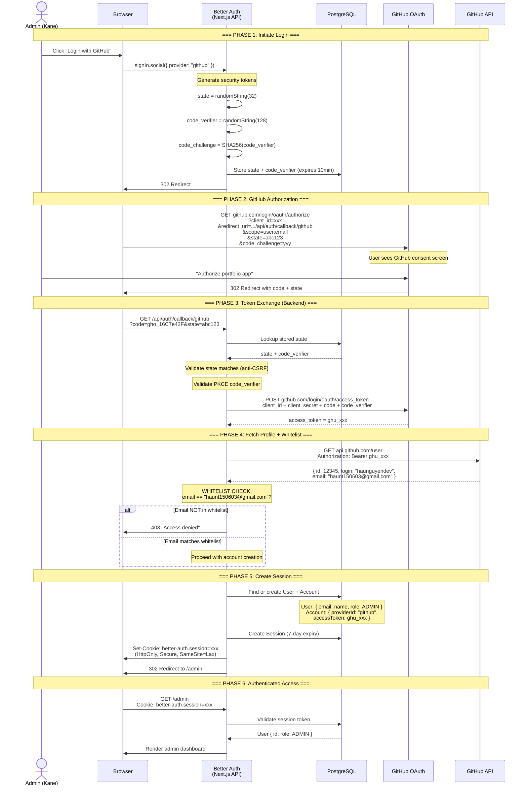
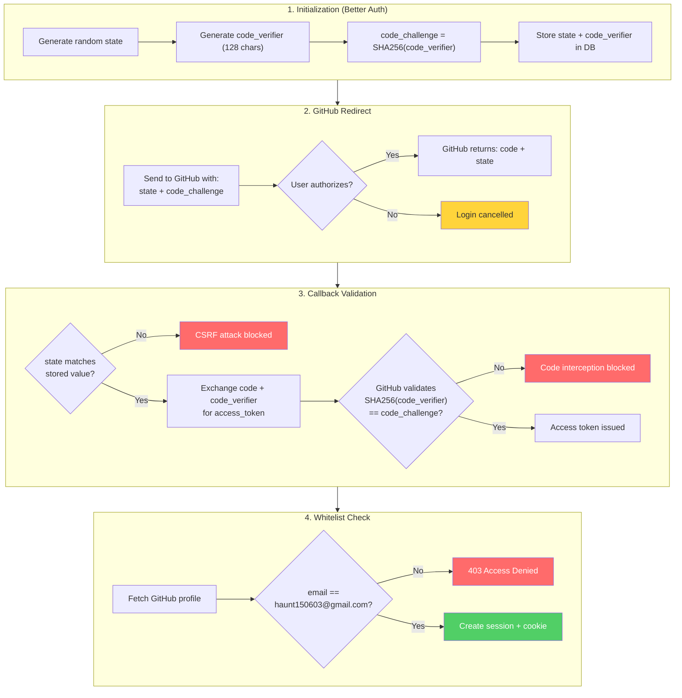

# Visual Explanation: GitHub OAuth Login Flow qua Better Auth

## Overview

Giải thích chi tiết flow login GitHub OAuth cho admin dashboard portfolio (`portfolio.haunguyendev.xyz`). Better Auth xử lý toàn bộ OAuth 2.0 dance — PKCE, state validation, token exchange, session creation — tự động.

## Quick View (ASCII)

```
┌─────────────────────────────────────────────────────────────────────────┐
│                    GITHUB OAUTH LOGIN FLOW                              │
│                    portfolio.haunguyendev.xyz                            │
├─────────────────────────────────────────────────────────────────────────┤
│                                                                         │
│  ┌──────────┐    ┌──────────────────┐    ┌──────────┐    ┌──────────┐  │
│  │  Browser  │───►│  Better Auth     │───►│  GitHub  │───►│ GitHub   │  │
│  │  (User)   │    │  (Next.js API)   │    │  OAuth   │    │ User DB  │  │
│  └──────────┘    └──────────────────┘    └──────────┘    └──────────┘  │
│       │                   │                    │               │        │
│  1. Click            2. Generate           3. User            │        │
│  "Login GitHub"      state + PKCE         authorizes          │        │
│       │                   │                    │               │        │
│       │              ┌────▼────┐          ┌────▼────┐         │        │
│       │              │ Store   │          │ Return  │         │        │
│       │              │ state + │          │ auth    │         │        │
│       │              │ verifier│          │ code    │         │        │
│       │              │ in DB   │          │ + state │         │        │
│       │              └─────────┘          └────┬────┘         │        │
│       │                                        │              │        │
│       │    4. Callback: /api/auth/callback/github              │        │
│       │    ┌──────────────────────────────────┐               │        │
│       │    │ a. Validate state (anti-CSRF)    │               │        │
│       │    │ b. Validate PKCE code_verifier   │               │        │
│       │    │ c. Exchange code → access_token  │───────────────┘        │
│       │    │ d. Fetch GitHub user profile     │                        │
│       │    │ e. Check whitelist (email match) │                        │
│       │    │ f. Create/link Account record    │                        │
│       │    │ g. Create Session + set cookie   │                        │
│       │    └──────────────┬───────────────────┘                        │
│       │                   │                                             │
│       │◄──────────────────┘                                             │
│  5. Redirect to /admin                                                  │
│     (with session cookie)                                               │
│                                                                         │
│  ┌──────────────────── Database ────────────────────┐                  │
│  │  User: { id, email, name, role: ADMIN }          │                  │
│  │  Account: { providerId: "github", accessToken }  │                  │
│  │  Session: { token, expiresAt: 7 days }           │                  │
│  └──────────────────────────────────────────────────┘                  │
│                                                                         │
└─────────────────────────────────────────────────────────────────────────┘
```

## Detailed Flow — Sequence Diagram



## Security Flow — PKCE + State Validation



## Login Page — Before vs After

```
BEFORE (Email/Password)              AFTER (GitHub Only)
┌───────────────────────┐           ┌───────────────────────┐
│     Admin Login       │           │     Admin Login       │
│                       │           │                       │
│  Email:               │           │  Sign in to manage    │
│  ┌─────────────────┐  │           │  your portfolio       │
│  │ admin@example   │  │           │                       │
│  └─────────────────┘  │           │  ┌─────────────────┐  │
│                       │           │  │  ◉ Continue with │  │
│  Password:            │           │  │    GitHub        │  │
│  ┌─────────────────┐  │    →→→    │  └─────────────────┘  │
│  │ ••••••••        │  │           │                       │
│  └─────────────────┘  │           │  Only authorized      │
│                       │           │  GitHub accounts      │
│  [    Sign in     ]   │           │  can access.          │
│                       │           │                       │
└───────────────────────┘           └───────────────────────┘
```

## Key Concepts

### 1. **PKCE (Proof Key for Code Exchange)**
Bảo vệ chống code interception. Ngay cả khi attacker bắt được `code` từ redirect URL, họ không thể exchange thành access_token vì không có `code_verifier`.

```
Client:  code_verifier = "random128chars..."
         code_challenge = SHA256(code_verifier)
         → Send code_challenge to GitHub

GitHub:  Returns code to callback URL

Backend: Send code + code_verifier to GitHub
GitHub:  Check SHA256(code_verifier) == code_challenge
         → If match: issue access_token
         → If not: reject (attacker blocked)
```

### 2. **State Parameter (Anti-CSRF)**
Ngăn chặn CSRF attack. Attacker không thể giả mạo OAuth flow vì không biết `state` value.

```
Before redirect:  Store state="abc123" in DB
After callback:   Check returned state matches stored value
                  → If match: legitimate flow
                  → If not: CSRF attack → reject
```

### 3. **Whitelist Hook (Admin Restriction)**
Better Auth hook `before` trên `createUser` kiểm tra email GitHub. Chỉ `haunt150603@gmail.com` mới tạo được user.

```typescript
// In auth.ts
user: {
  hooks: {
    before: {
      createUser: async (user) => {
        if (user.email !== "haunt150603@gmail.com") {
          throw new Error("Access denied")
        }
      }
    }
  }
}
```

### 4. **Session Cookie vs OAuth Token**

| | OAuth Token (GitHub) | Session Cookie (Better Auth) |
|---|---|---|
| **Stored in** | `accounts` table | `sessions` table + browser cookie |
| **Lifetime** | Indefinite (until revoked) | 7 days (auto-refresh) |
| **Used for** | Calling GitHub API | Authenticating admin requests |
| **Visible to client** | No (server-side only) | As encrypted cookie |
| **Security** | Never exposed to frontend | HttpOnly + Secure + SameSite |

### 5. **Account Linking**
Better Auth tự link GitHub account vào User record. Schema:

```
User (id: "abc")
  ├── Account (providerId: "github", providerAccountId: "12345")
  │   └── accessToken: "ghu_xxx"
  └── Session (token: "sess_yyy", expiresAt: +7 days)
```

## Implementation Changes

```
Files to modify:
├── apps/web/src/lib/auth.ts              ← Add socialProviders.github + whitelist hook
├── apps/web/src/app/(auth)/admin/login/  ← Replace form → "Login with GitHub" button
├── .env / .env.example                   ← Add GITHUB_CLIENT_ID, GITHUB_CLIENT_SECRET
└── Server /opt/portfolio/.env            ← Add same 2 env vars

NO changes needed:
├── Prisma schema (Account table already has OAuth fields)
├── auth-client.ts (signIn.social already available)
├── NestJS API (session-token strategy unchanged)
└── Docker/CI/CD (just env vars, no rebuild logic change)
```
