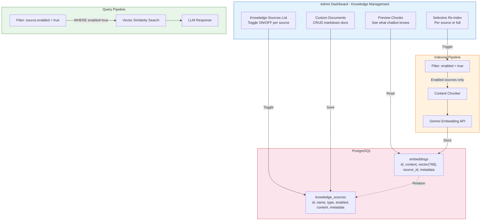
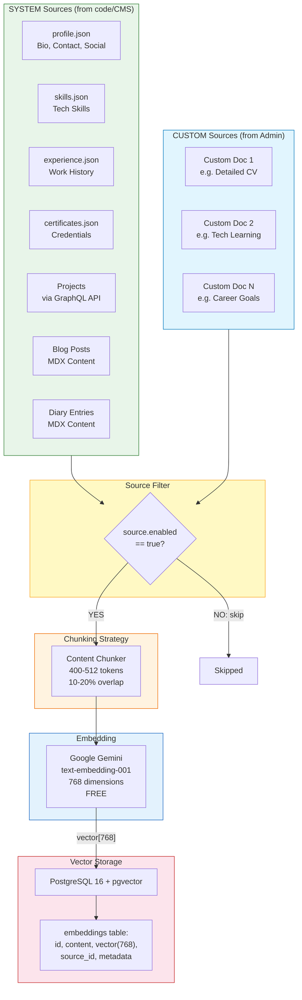
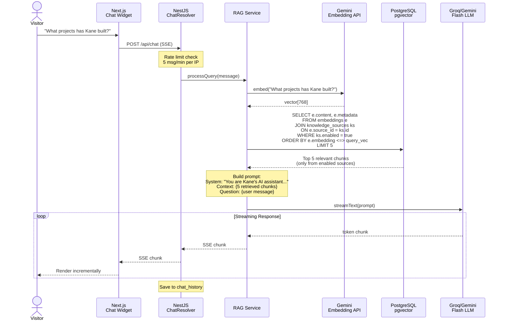
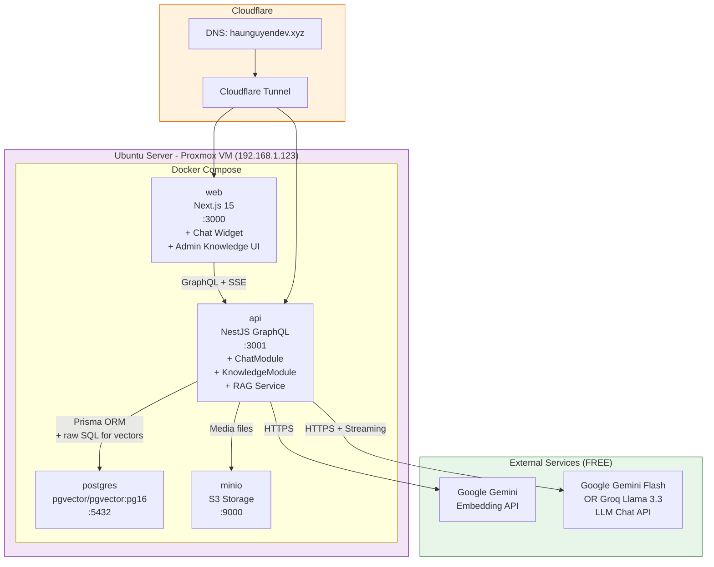

# Diagram: RAG AI Chatbot Architecture for Portfolio

## 1. System Architecture Overview (ASCII)

```
┌──────────────────────────────────────────────────────────────────────────┐
│                          PORTFOLIO WEBSITE                               │
│                                                                          │
│  ┌───────────────────────┐          ┌──────────────────────────────────┐ │
│  │   Next.js Frontend    │          │     NestJS GraphQL API           │ │
│  │                       │          │                                  │ │
│  │  ┌─────────────────┐  │  SSE     │  ┌────────────────────────────┐  │ │
│  │  │  Chat Widget    │──┼─────────►│  │  ChatModule                │  │ │
│  │  │  (useChat)      │◄─┼─────────┐│  │  ├─ ChatResolver           │  │ │
│  │  └─────────────────┘  │ Stream  ││  │  ├─ ChatService             │  │ │
│  │                       │         ││  │  └─ RAG Pipeline            │  │ │
│  │  ┌─────────────────┐  │         ││  └─────────┬──────────────────┘  │ │
│  │  │  Admin Dashboard │  │         ││            │                     │ │
│  │  │  ┌────────────┐  │  │         ││  ┌─────────▼──────────────────┐  │ │
│  │  │  │ Knowledge  │──┼──┼─────────┼┼─►│  KnowledgeModule           │  │ │
│  │  │  │ Management │  │  │         ││  │  ├─ KnowledgeResolver      │  │ │
│  │  │  └────────────┘  │  │         ││  │  ├─ KnowledgeService       │  │ │
│  │  └─────────────────┘  │         ││  │  └─ IndexingService         │  │ │
│  │                       │         ││  └────────────────────────────┘  │ │
│  │  Pages:               │         ││                                  │ │
│  │  - Home, Projects     │         ││  ┌────────────────────────────┐  │ │
│  │  - About, Blog, Diary │         ││  │  Existing Modules          │  │ │
│  └───────────────────────┘         ││  │  Posts, Projects, Certs    │  │ │
│                                    ││  └────────────────────────────┘  │ │
│                                    │└──────────────────────────────────┘ │
└────────────────────────────────────┼────────────────────────────────────┘
                                     │
          ┌──────────────────────────┼──────────────────────┐
          │                         │                       │
          ▼                         ▼                       ▼
┌──────────────────┐  ┌──────────────────────┐  ┌────────────────────┐
│  PostgreSQL 16   │  │   Gemini Embedding   │  │   Groq / Gemini    │
│  + pgvector      │  │   API (FREE)         │  │   Flash (FREE)     │
│                  │  │                      │  │                    │
│  Tables:         │  │  text → vector       │  │  context + query   │
│  - embeddings    │  │  768 dimensions      │  │  → answer stream   │
│  - knowledge_src │  │  1500 RPM free       │  │  30 RPM free       │
│  - chat_history  │  └──────────────────────┘  └────────────────────┘
│  - existing...   │
└──────────────────┘
```

## 2. Knowledge Base Management Flow (NEW)



## 3. Indexing Pipeline (with Source Management)



## 4. Query Pipeline (with Source Filtering)



## 5. Admin Knowledge Management UI (ASCII Wireframe)

```
┌─────────────────────────────────────────────────────────┐
│  Admin > Knowledge Base                    [Re-index All]│
├─────────────────────────────────────────────────────────┤
│                                                          │
│  SYSTEM SOURCES                                          │
│  ┌──────────────────────────────────────────────────┐    │
│  │ Source           │ Chunks │ Last Index  │ Status  │    │
│  ├──────────────────┼────────┼─────────────┼─────────┤    │
│  │ Profile & Bio    │   1    │ 2 hours ago │ [✅ ON] │    │
│  │ Skills           │   4    │ 2 hours ago │ [✅ ON] │    │
│  │ Experience       │   3    │ 2 hours ago │ [✅ ON] │    │
│  │ Projects         │   8    │ 2 hours ago │ [✅ ON] │    │
│  │ Blog Posts       │  12    │ 2 hours ago │ [✅ ON] │    │
│  │ Diary Entries    │   6    │ 2 hours ago │ [❌ OFF]│    │
│  │ Certificates     │   5    │ 2 hours ago │ [✅ ON] │    │
│  └──────────────────┴────────┴─────────────┴─────────┘    │
│                                                          │
│  CUSTOM DOCUMENTS                          [+ Add New]   │
│  ┌──────────────────────────────────────────────────┐    │
│  │ Document         │ Chunks │ Last Index  │ Actions │    │
│  ├──────────────────┼────────┼─────────────┼─────────┤    │
│  │ Detailed CV      │   3    │ 1 day ago   │ [✏️][🗑]│    │
│  │ Tech Learning    │   2    │ 3 days ago  │ [✏️][🗑]│    │
│  │ Career Goals     │   1    │ 1 week ago  │ [✏️][🗑]│    │
│  └──────────────────┴────────┴─────────────┴─────────┘    │
│                                                          │
│  CHUNK PREVIEW (click source to view)                    │
│  ┌──────────────────────────────────────────────────┐    │
│  │ Source: Projects > Portfolio V2                    │    │
│  │ ─────────────────────────────────────────────     │    │
│  │ "Kane built Portfolio V2, a full-stack personal   │    │
│  │  website using Next.js 15, NestJS, GraphQL,       │    │
│  │  PostgreSQL, and Docker. Features include CMS     │    │
│  │  admin dashboard, blog system, and AI chatbot..." │    │
│  │                                                    │    │
│  │ Tokens: 487 | Vector dims: 768 | Similarity: N/A  │    │
│  └──────────────────────────────────────────────────┘    │
└─────────────────────────────────────────────────────────┘
```

## 6. Selective Re-index Flow (ASCII)

```
┌─────────────────── SELECTIVE RE-INDEX ───────────────────┐
│                                                          │
│  Trigger: Admin clicks [Re-index] on specific source     │
│                                                          │
│  ┌──────────────────────────────────────────────────┐    │
│  │ Step 1: DELETE existing chunks                    │    │
│  │         WHERE source_id = selected_source         │    │
│  └──────────────────────┬───────────────────────────┘    │
│                         ▼                                │
│  ┌──────────────────────────────────────────────────┐    │
│  │ Step 2: READ latest content                       │    │
│  │         SYSTEM → read from JSON/API/MDX           │    │
│  │         CUSTOM → read from knowledge_sources.content│   │
│  └──────────────────────┬───────────────────────────┘    │
│                         ▼                                │
│  ┌──────────────────────────────────────────────────┐    │
│  │ Step 3: CHUNK content                             │    │
│  │         RecursiveCharacterTextSplitter            │    │
│  │         400-512 tokens, 10-20% overlap            │    │
│  └──────────────────────┬───────────────────────────┘    │
│                         ▼                                │
│  ┌──────────────────────────────────────────────────┐    │
│  │ Step 4: EMBED chunks via Gemini API               │    │
│  │         Batch: 5-10 chunks per request            │    │
│  └──────────────────────┬───────────────────────────┘    │
│                         ▼                                │
│  ┌──────────────────────────────────────────────────┐    │
│  │ Step 5: INSERT new embeddings                     │    │
│  │         WITH source_id = selected_source          │    │
│  └──────────────────────────────────────────────────┘    │
│                                                          │
│  Total time: ~2-5 seconds per source                     │
└──────────────────────────────────────────────────────────┘
```

## 7. Docker Deployment View



## 8. New Files to Create (Updated)

```
apps/api/src/
  ├── chat/                              ← CHAT MODULE
  │   ├── chat.module.ts
  │   ├── chat.controller.ts             ← REST SSE endpoint
  │   ├── chat.service.ts
  │   ├── rag/
  │   │   ├── rag.service.ts             ← RAG orchestration
  │   │   ├── content-chunker.service.ts ← Content → chunks
  │   │   ├── embedding.service.ts       ← Gemini Embedding API
  │   │   └── vector-store.service.ts    ← pgvector queries
  │   └── dto/
  │       ├── chat-input.dto.ts
  │       └── chat-response.dto.ts
  │
  └── knowledge/                         ← KNOWLEDGE MODULE (Phase 7)
      ├── knowledge.module.ts
      ├── knowledge.resolver.ts          ← GraphQL CRUD
      ├── knowledge.service.ts           ← Business logic
      ├── indexing.service.ts            ← Selective re-index
      └── dto/
          ├── knowledge-source.input.ts
          └── custom-document.input.ts

apps/web/src/
  ├── components/
  │   └── chat/                          ← CHAT WIDGET
  │       ├── chat-widget.tsx            ← Floating bubble + panel
  │       ├── chat-messages.tsx          ← Message list
  │       ├── chat-input.tsx             ← Input field
  │       └── chat-bubble.tsx            ← Individual message
  │
  └── app/(admin)/admin/
      └── knowledge/                     ← ADMIN KNOWLEDGE PAGE (Phase 7)
          ├── page.tsx                   ← Source list + toggles
          ├── documents/
          │   ├── new/page.tsx           ← Create custom doc
          │   └── [id]/edit/page.tsx     ← Edit custom doc
          └── components/
              ├── source-table.tsx       ← System sources table
              ├── document-table.tsx     ← Custom docs table
              └── chunk-preview.tsx      ← Preview chunks panel

packages/prisma/schema.prisma           ← Add KnowledgeSource + Embedding models
```
